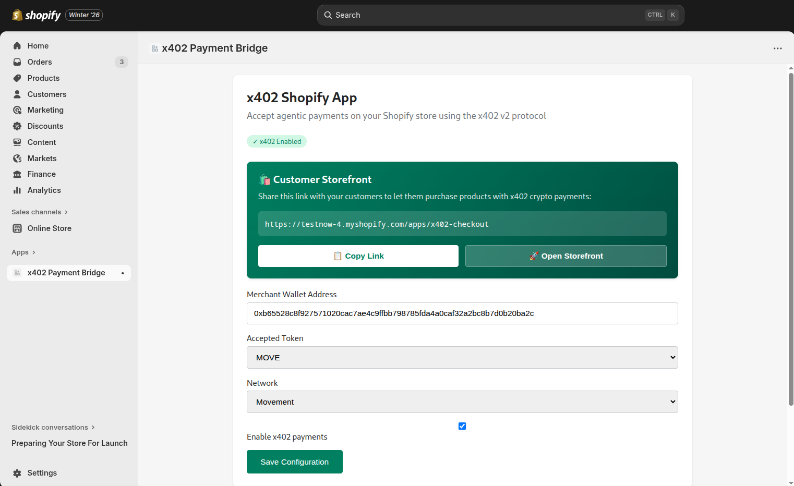
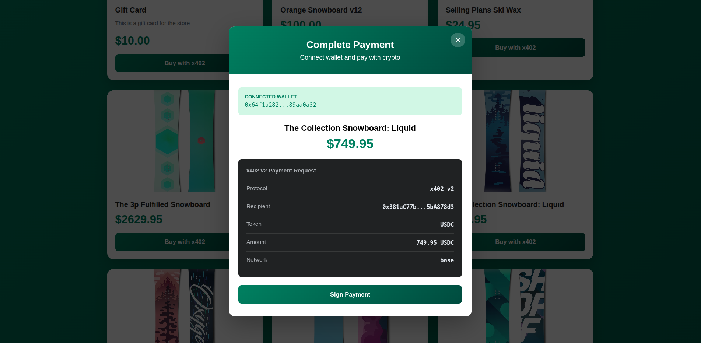
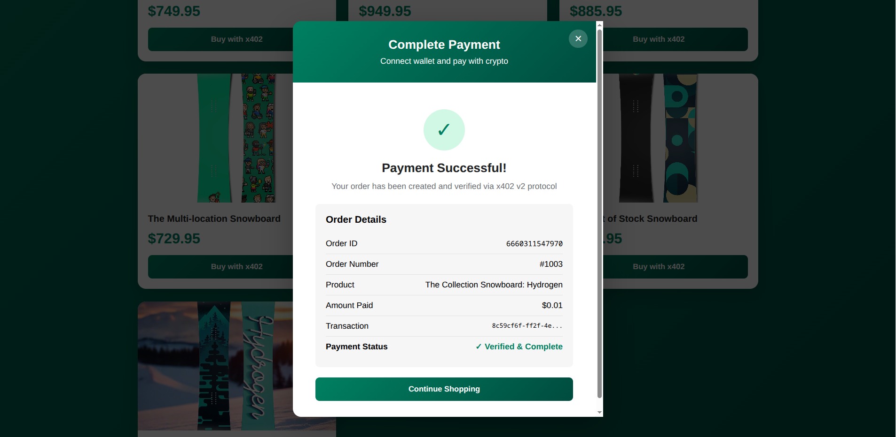

# x402 Shopify App

### Bringing Movement Network's Lightning-Fast Payments to 4.4M+ Shopify Stores

## 🎯 The Problem
Traditional e-commerce is stuck in Web2. AI agents and crypto-native users can't seamlessly purchase products from Shopify stores and Movement Network's speed and efficiency can't reach the millions of merchants on Shopify.

## ✨ Our Solution
A Shopify app that bridges Web2 commerce with Web3 payments using the x402 v2 protocol on Movement mainnet.

## 🚀 Live Demo Flow

### Part 1: Merchant Onboarding (30 seconds)
1. "A Shopify merchant installs our app with one click"
2. Show: App installation screen
3. "They configure their crypto wallet to receive payments"
4. Show: Configuration page with wallet address, token, network
5. "Enable x402 and they're done!"

### Part 2: Customer Experience (60 seconds)
1. "Now customers can visit their store's x402 checkout"
2. Show: `store.myshopify.com/apps/x402-checkout`
3. "Browse real products from the Shopify catalog"
4. Show: Product grid with actual store products
5. "Click 'Buy with x402' and connect wallet"
6. Show: Nightly wallet connection
7. "Review the x402 v2 payment request"
8. Show: Payment details (protocol, recipient, amount, network)
9. "Sign the transaction"
10. Show: Transaction signing
11. "Payment verified and order created!"
12. Show: Success screen with order details

### Part 3: Merchant Verification (20 seconds)
1. "The merchant sees the order in their Shopify admin"
2. Show: Shopify Orders page
3. "Complete order details with crypto payment info"
4. "Status: Paid via x402 v2 Protocol"

## 🌐 Try the Live Demo

**Live Storefront**: [https://testnow-4.myshopify.com/apps/x402-checkout](https://testnow-4.myshopify.com/apps/x402-checkout)

### 🔐 Important: Test Store Password Protection

This is a Shopify development store, which requires password protection per Shopify's policies. Here's what to expect:

**First Visit:**
1. You'll see a Shopify password page
2. Enter password: `ofreil`
3. Shopify will redirect you to the main store homepage (this is default Shopify behavior)
4. **Manually navigate back** to: `https://testnow-4.myshopify.com/apps/x402-checkout`

**Subsequent Visits:**
- You'll go directly to the x402 checkout (password is remembered)
- Full customer experience as intended

> **Note for Judges**: This password step is a Shopify development store requirement and would NOT exist on a production store. Live Shopify stores (like those of the 4.4M+ merchants) have no password protection and would load the x402 checkout directly on first visit.

### 💳 To Complete a Test Purchase:

1. Browse products from the live Shopify catalog
2. Click "Buy with x402" on any product
3. Install [Nightly Wallet](https://nightly.app/) if you don't have it
4. Connect your wallet
5. Review the x402 v2 payment request
6. Sign the transaction on Movement Network
7. See your order created in real-time!

**What You'll Need:**
- Nightly Wallet browser extension
- Small amount of MOVE tokens on Movement Network (for test purchases)

## 🎨 Key Features to Highlight
- ✅ One-click Shopify app installation
- ✅ x402 v2 protocol compliance
- ✅ Real product catalog integration
- ✅ Wallet connection
- ✅ Facilitator verification
- ✅ Automatic Shopify order creation
- ✅ Beautiful, intuitive UI
- ✅ Native-looking integration (`/apps/x402-checkout`)

## 💡 Technical Highlights
- Shopify App Proxy for seamless URL integration
- x402 v2 facilitator for trustless verification
- REST API for product fetching and order creation
- Real-time payment verification
- Postgres database for payment tracking

## 🚀 Why Movement Network?

- ⚡ **Sub-second finality** - Orders confirmed instantly
- 💰 **Fraction-of-a-cent fees** - Merchants keep more revenue
- 🌐 **Built for scale** - Ready for mainstream adoption

## 🏆 Why This
1. **Complete Solution**: End-to-end working implementation
2. **Real Integration**: Actually creates Shopify orders
3. **Beautiful UX**: Professional, modern design
4. **x402 Compliance**: Properly implements v2 protocol
5. **Market Ready**: Merchants can actually use this today
